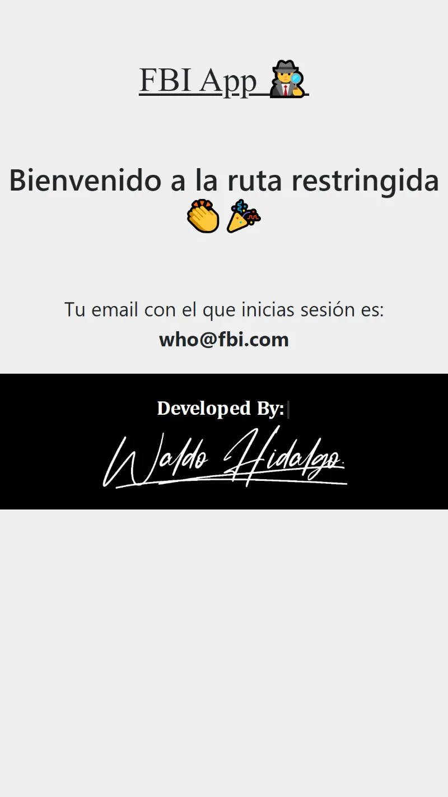

# Solución al Desafío FBI System

Repositorio con el código solución del Desafío Cuatro: FBI System del módulo 8 **Implementación de API backend Node Express** de la beca **Desarrollo de aplicaciones Full Stack Javascript Trainee** dada por Talento Digital para Chile y dictada por Desafío Latam.

Se ha utilizado express-handlebars que compila archivos handlebars a código html

## Tabla de Contenidos

- [Solución al Desafío FBI System](#solución-al-desafío-fbi-system)
  - [Tabla de Contenidos](#tabla-de-contenidos)
  - [Deploy](#deploy)
  - [Requisitos](#requisitos)
  - [Screenshots](#screenshots)
    - [1.Home](#1home)
    - [2. Página Email y Password Incorrectos](#2-página-email-y-password-incorrectos)
    - [3. Sesión establecida](#3-sesión-establecida)
    - [4. Página Privada](#4-página-privada)
    - [5. Página Acceso Prohibido](#5-página-acceso-prohibido)
  - [Soluciones](#soluciones)
    - [1. Crear una ruta que autentique a un agente basado en sus credenciales y genere un token con sus datos. (3 Puntos)](#1-crear-una-ruta-que-autentique-a-un-agente-basado-en-sus-credenciales-y-genere-un-token-con-sus-datos-3-puntos)
    - [2. Al autenticar un agente, devolver un HTML que:](#2-al-autenticar-un-agente-devolver-un-html-que)
    - [3. Crear una ruta restringida que devuelva un mensaje de Bienvenida con el correo del agente autorizado, en caso contrario devolver un estado HTTP que indique que el usuario no está autorizado y un mensaje que menciona la descripción del error. (3 Puntos)](#3-crear-una-ruta-restringida-que-devuelva-un-mensaje-de-bienvenida-con-el-correo-del-agente-autorizado-en-caso-contrario-devolver-un-estado-http-que-indique-que-el-usuario-no-está-autorizado-y-un-mensaje-que-menciona-la-descripción-del-error-3-puntos)

## Deploy

El proyecto es 100% funcional y ha sido desplegado en vercel en el siguiente [link](https://desafio-fbi-system.vercel.app/)

## Requisitos


## Screenshots

### 1.Home


### 2. Página Email y Password Incorrectos


### 3. Sesión establecida


### 4. Página Privada



### 5. Página Acceso Prohibido


## Soluciones

### 1. Crear una ruta que autentique a un agente basado en sus credenciales y genere un token con sus datos. (3 Puntos)

He creado la siguiente ruta que cumple con lo solicitado:

```js
router.post("/login", login);
```

La cual utiliza la siguiente función **login**:

```js
export function login(req, res) {
  const { email, password } = req.body;

  const user = results.find(
    (user) => user.email === email && user.password === password
  );
  if (user) {
    jwt.sign(user, secretKey, { expiresIn: 60 * 2 }, (err, token) => {
      if (err) {
        res.status(500).send("Ha ocurrido un error");
        return;
      }
      res.render(path.resolve("api", "views", "pages", "login.hbs"), {
        email,
        token,
      });
    });
  } else {
    res
      .status(401)
      .render(
        path.resolve("api", "views", "pages", "credenciales_incorrectas.hbs")
      );
  }
}
```

### 2. Al autenticar un agente, devolver un HTML que:

a. Muestre el email del agente autorizado.
b. Guarde un token en SessionStorage con un tiempo de expiración de 2 minutos.
c. Disponibiliza un hiperenlace para redirigir al agente a una ruta restringida.
(4 Puntos)

He creado el siguiente HTML el cual muestra lo pedido:


El código siguiente me permite establecer en el session storage el token creado:

```js
const token = "{{{token}}}";
const email = "{{{email}}}";
sessionStorage.setItem("user", JSON.stringify({ email, token }));
```

En el navegador se almacena correctamente tal y como muestro a continuación:


### 3. Crear una ruta restringida que devuelva un mensaje de Bienvenida con el correo del agente autorizado, en caso contrario devolver un estado HTTP que indique que el usuario no está autorizado y un mensaje que menciona la descripción del error. (3 Puntos)

He creado la siguiente ruta restringida:

```js
router.get("/private", renderPrivate);
```

La cual utiliza la siguiente función **renderPrivate**:

```js
export function renderPrivate(req, res) {
  const { token } = req.query;

  jwt.verify(token, secretKey, (err, data) => {
    console.log(data);
    if (err) {
      res
        .status(401)
        .render(path.resolve("api", "views", "pages", "prohibido.hbs"));
      return;
    }
    res
      .status(200)
      .render(path.resolve("api", "views", "pages", "private.hbs"), {
        email: data.email,
      });
  });
}
```

En caso de que el token sea válido entonces se muestra la siguiente página:


En caso de que el tokes sea inválido entonces se envía un código de estado 401 (Unauthorized Access) y se muestra la siguiente página:


